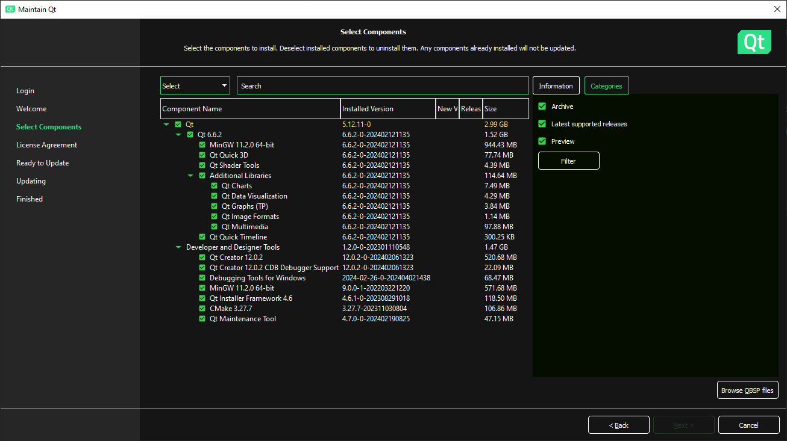

# Building on Windows

## 0. Prerequisites

- Qt Creator 12.x.x
- Qt 6.6.x

> [Download Qt](https://www.qt.io/download)

> [Download Qt for Open Source](https://www.qt.io/download-open-source)

### Required Qt components



## 1. Source code

```sh
git clone https://github.com/maidesu/video-to-dialogue.git
```

## 2. a\) Building FFmpeg from source

### 0. Build tools

- [MSYS2](https://www.msys2.org/)
- MinGW

MSYS2 packages:

```sh
pacman -S make pkgconf diffutils
pacman -S mingw-w64-x86_64-nasm mingw-w64-x86_64-gcc mingw-w64-x86_64-SDL2
```

### 1. Fetching project submodules

```sh
cd video-to-dialogue
git submodule update --init --recursive
```

### 2. Configuring FFmpeg

```sh
./lib/ffmpeg/configure --prefix=$PWD/lib --shlibdir='${prefix}/lib' --enable-shared --target-os=mingw64 --disable-programs --disable-doc --disable-debug --enable-pic --disable-autodetect
```

### 3. Building FFmpeg

```sh
make
make install
```

## 2. b\) Using prebuilt FFmpeg

### 1. Obtain the [shared prebuilt libraries](https://www.gyan.dev/ffmpeg/builds/) (release: [6.6.1](https://www.gyan.dev/ffmpeg/builds/packages/ffmpeg-6.1.1-full_build-shared.7z))

### 2. Copy the following files to their appropriate locations

- *`ffmpeg-6.6.1-full_build-shared/include/*` to `lib/include/*`*
- *`ffmpeg-6.6.1-full_build-shared/lib/*` to `lib/lib/*`*
- *`ffmpeg-6.6.1-full_build-shared/bin/*.dll` to `lib/lib/*.dll`*

## 3. Configure project

### Developing in Qt Creator

1. Open the project file `dialogue_from_video.pro` located in the root directory.

2. Select one of the kits to be used for compilation.

3. Click "Configure Project".

4. Use a profile and one of the options on the *bottom-left* to *build*, *debug* or *run* the project.
